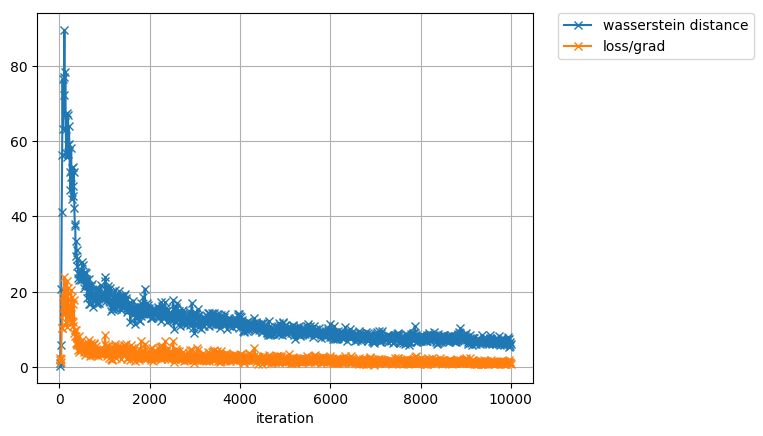
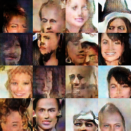

# WGAN-GP
A Chainer implementation of [Improved Training of Wasserstein GANs](https://arxiv.org/abs/1704.00028).

# Usage
## WGAN-GP with MNIST(with GPU #n)
```
python wgangp_mnist.py -g n
```

## WGAN-GP with MNIST(without GPU)
```
python wgangp_mnist.py
```

## WGAN-GP with CelebA(with GPU #n)
```
python wgangp_mnist.py -g n
```

## WGAN-GP with CelebA(without GPU)
```
python wgangp_mnist.py
```

# Result
## wasserstain distance


## generated images

